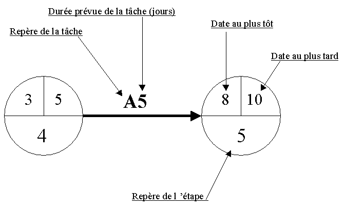

# PERT

La méthode PERT est un outil de planification qui permet de modéliser un projet sous forme de réseau, d’identifier son chemin critique et de calculer les marges de flexibilité des tâches.

## Les 6 étapes pour construire un PERT

### 1. Préparez les tâches

Listez toutes les tâches du projet (exhaustif mais gérable).
Utilisez le WBS (Work Breakdown Structure) ou un brainstorming pour ne rien oublier.

### 2. Estimez leur durée et leurs antécédents

Pour chaque tâche : durée et dépendances. Réaliser le tableau d'antériorité suivant : 

| Tâche | Durée | Antécédent(s) |
| ----- | ----- | ------------- |
| A     | 2     | -             |
| B     | 8     | -             |

### 3. Construisez le réseau PERT

- Représentez les tâches par des flèches.
- Reliez-les selon leurs antécédents.
- Ajoutez des tâches fictives (durée = 0) quand une tâche a plusieurs antécédents.



### 4. Calculez les dates au plus tôt

- Début au plus tôt d’une tâche = max(fin au plus tôt de ses antécédents)
- Fin au plus tôt = début au plus tôt + durée

### 5. Calculez les dates au plus tard

- On part de la fin du projet (date au plus tard = date au plus tôt finale).
- Fin au plus tard d’une tâche = min(début au plus tard des successeurs)
- Début au plus tard = fin au plus tard – durée

### 6. Calculez les marges et identifiez le chemin critique

#### Marge totale (MT)

Retard max possible sans retarder la fin du projet.

Formule de la marge totale : 
```
Date au plus tard de fin de la tâche – Date au plus tôt de fin de la tâche
```

#### Marge libre (ML)

Retard max possible sans retarder le début au plus tôt des successeurs directs.

Formule de la marge libre : 
```
Date au plus tôt de début du successeur – Date au plus tôt de fin de la tâche
```

#### Chemin critique

C’est le chemin constitué des tâches dont la marge totale = 0.
Il donne la durée minimale incompressible du projet.

#### Exemple de marges

| Tâche | Marge libre | Marge totale |
| ----- | ----------- | ------------ |
| A     | 0           | 12           |
| C     | 12          | 12           |
| B     | 0           | 0            |
| D     | 0           | 6            |
| G     | 6           | 6            |
| E     | 0           | 0            |
| F     | 0           | 0            |

Le chemin critique est constitué de B – E – F.

## En résumé

Le PERT permet de :

- Visualiser les dépendances entre tâches.
- Calculer les dates au plus tôt et au plus tard.
- Déterminer les marges et le chemin critique.

Il est un outil essentiel de planification et de gestion des délais.