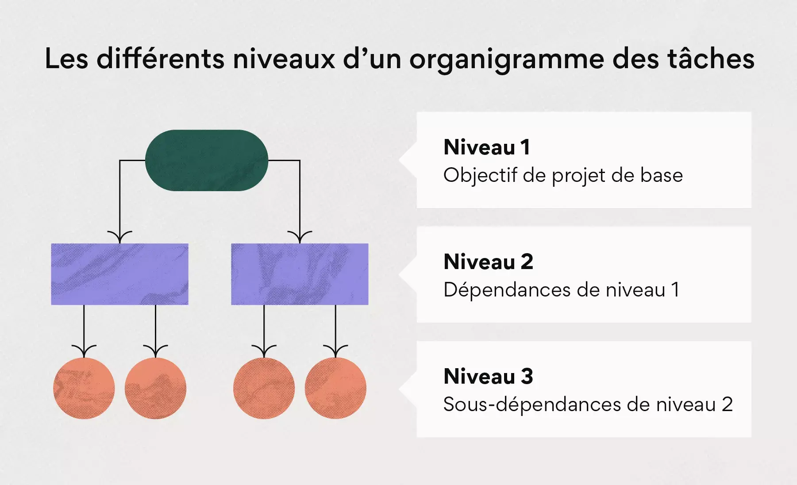

# Travailler en mode projet

## Work Breakdown Structure (WBS)

Le WBS (Work Breakdown Structure, ou organigramme des tâches) est une représentation hiérarchique et visuelle de l’ensemble du contenu d’un projet. Il permet de découper un projet en sous-éléments clairs, détaillés et gérables. Chaque niveau de la structure précise les objectifs à atteindre, les livrables attendus, les échéances associées et les acteurs clés responsables.

En plus de ces éléments, le WBS peut inclure des informations complémentaires comme les jalons, les budgets prévus ou encore les approbations nécessaires. Il constitue ainsi une version condensée et structurée de la charte de projet, offrant une vision globale et partagée qui facilite le suivi, la communication et la coordination des équipes.

En résumé, le WBS est le plan détaillé et visuel du projet, servant de référence pour piloter efficacement chaque étape.

### Utilité du WBS

- Clarifie la structure du projet.
- Facilite la communication entre équipes.
- Permet un suivi efficace des délais, budgets et livrables.
- Sert de référence pour mesurer la progression et identifier les problèmes.
- Sert de base au planning (diagramme de Gantt, estimation des charges, suivi d’avancement).

### Notion de niveaux hiérarchiques

Le WBS est construit de manière hiérarchique :

- Niveau 1 : le projet dans son ensemble.
- Niveau 2 : grands lots ou phases du projet.
- Niveau 3 : sous-lots, tâches détaillées et livrables associés.

Chaque niveau permet d’affiner la granularité et de mieux répartir le travail.

### Informations clés à documenter pour chaque tâche

1. Description de la tâche
    - Nom + objectif rapide.
    - Détails supplémentaires dans le lexique.
2. Responsable de la tâche
    - Attribution claire pour assurer responsabilisation et communication.
    - Facilite la remontée d’informations.
3. Budget de la tâche
    - Optionnel, mais essentiel pour les projets à gros budget.
    - Permet de surveiller les coûts et éviter les dépassements.
4. Date d’achèvement / Durée
    - Permet de suivre le respect des délais.
    - Doit être intégrée dans un calendrier/outils de gestion.
5. Statut de la tâche
    - Exemple de statuts : ouverte, en cours, terminée.
    - Utile pour suivre l’avancement et repérer des blocages.
6. Approbations et jalons
- Certaines tâches nécessitent une validation (client, manager, comité).
- Les jalons marquent l’achèvement d’une étape clé dans le projet.
7. Lien avec les livrables
- Chaque tâche doit conduire à un résultat concret : document, prototype, module, validation d’étape.
- Cela garantit la cohérence entre tâches et objectifs du projet.

------------------------------------
# NOTES
------------------------------------

- Cycle en V
- Méthodes agiles
- GANTT & PERT

Pour chacune des tâches, nous allons devoir : 
- Description de la tâche
- Délai
- Responsable de la tâche
- Prix
- Statut
- Quels autres tâches sont necessaires pour démarrer ma tâche, dans quel ordre je dois faire cette tâche ?

- Définir les tâches
    - Choisir les technologies
        - L'OS sur lequel le site sera hébergé
        - Le Front
            - HTML
            - CSS
            - JS
        - Le Back
            - PHP
            - SQL
        - Analytics
            - GA4 - Google Analytics 4
            - GTM - Goole Tag Manager
    - Maquettage
    - Choisir un hébergeur
    - Définition de l'arborescence des pages
    - Définition du contenu des pages
    - Concevoir la BDD
    - Développer le site
    - Mettre en production
    - Tester
    - Valider
- répartition des tâches et des rôles

## Exemple 1 : Faire un nouveau site internet vitrine, pour présenter mon activité

### Demande client : Expression des besoins

Faire un nouveau site internet vitrine, pour présenter mon activité
Je veux pouvoir modifier les contenus
Je veux que le site soit responsive
Je veux quele site soit bien référencé
Je veux qu'il soit accessible

### Plannifier

1. Préciser la demande client et analyser l'ensemble du projet, identifier les besoins.
2. Devis
    - Précision des Délais
    - Prix
3. Cahier des charges
    - Fonctionnels
    - Techniques
    - Plannification
4. Contrat de prestation

- le but ? => OK
- quel type de société ? => SAS
- ce qui doit être mis en avant => OK
- charte graphique ? => je n'en ai pas
- voir des exemples 
- identifier les éléments d'une charte graphique
- Hébergement