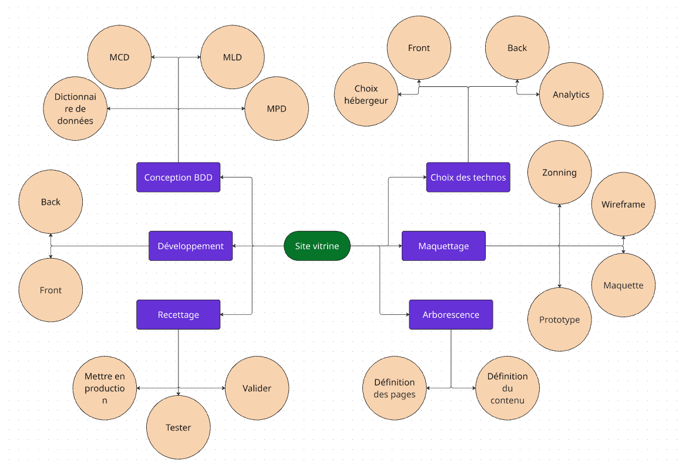

# Faire un nouveau site internet vitrine, pour présenter mon activité

## Demande client : Expression des besoins

Faire un nouveau site internet vitrine, pour présenter mon activité
Je veux pouvoir modifier les contenus
Je veux que le site soit responsive
Je veux quele site soit bien référencé
Je veux qu'il soit accessible

## Réalisation du Work Breakdown Structure (WBS)

- Projet de site vitrine
    - Choisir les technologies
        - Choisir un hébergeur
        - Le Front
        - Le Back
        - Analytics
    - Maquettage
        - Zonning => c'est le positionnement des éléments sur une page
        - Wireframe => c'est un zonning cliquable (qui permet de naviguer d'une page à une autre)
        - Maquette => la version graphique du zonning
        - Prototype => c'est l'équivalent du wireframe, mais avec des maquettes graphiques finalisées.
    - Arborescence
        - Définition des pages
        - Définition du contenu de chaque page
    - Concevoir la BDD
        - Dictionnaire de données
        - MCD => on représente les entités et leurs relations (sans PK/FK)
        - MLD => on représente les FK & PK
        - MPD => on vient tout typer de manière très précise
    - Développer le site
        - Front
        - Back
    - Recettage
        - Mettre en production
        - Tester
        - Valider

## TODO...