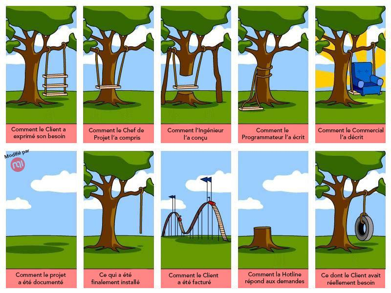
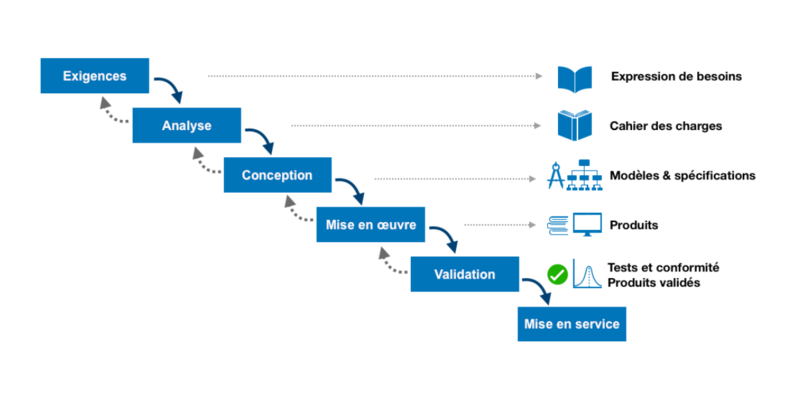

# Travailler en mode projet

## L'intérêt de la gestion de projet

la gestion de projet, c'est : planifier, **organisation**, temps, répartition,
écoute, besoins, demandeurs, gestion RH, coûts.

Rappel de l'intérêt de la gestion de projet : 

## La gestion de projet en cascade ou "Waterfall"

### Le fonctionnement de base

- `Exigences clients` : prendre des informations sur le site
- `Analyse` : Cahier des charges : fixer les besoins & solutions proposées et **vous protéger**
- `Conception` : Maquette
- `Mise en oeuvre` : On réalise ce qu'on a conçu
- `Validation` : On teste ce qu'on à mise en oeuvre
- `Mise en service` : Fin du projet

### Les problèmes du waterfall

- C'est une méthode rigide
- Découverte des erreurs tardives qui plantent le projet alors qu'il est (beaucoup) avancé
- communication limitée
- inadéquation entre le besoin exprimé et le besoin réel
- manque de visibilité sur l'avancement
- manque d'évolutivité

## Cycle en V

### Représentation

### 1. Analyse

- Cahier des charges
- (ou) Expression des besoins
- Analyse de l'existant
- Analyse des risques

### 2. Spécifications fonctionnelles

- Cahier des charges fonctionnel
- Scénarios d'usages (par les utilisateurs)
- Schémas fonctionnels

### 3. Spécifications techniques

- Cahier des charges technique
- Analyse de l'existant
- Choix des technologies et protocoles utilisés
- Schémas techniques

### 4. Spécifications détaillées

- Dossier de conception détaillé (paramètres, scripts, configs, etc...)
- Schémas / plans de ce qui va être mis en place (définitifs)
- Documentation des équipements 
- Scripting 
- Dossier de procédures

### 5. Réalisation

- Documentation de l'installation et de la mise en service (inclu les mdp etc...)
- Dossier de configuration
- Journal d'interventions (+ le temps)

### 6. Tests unitaires

- Plan de test unitaire (on teste chaque élément de manière indépendante - un par un)
- Compte rendu des tests par unité
- Rapport d'anomalies
- Scripts || Automation pour les tests !

### 7. Tests d'intégration

- Plan de test d'intégration (on teste tous les éléments ensembles - dans leur enchainement métier)
- Journal de résultats (= compte rendu) OK/KO
- Rapport d'intégration (preuve de bon fonctionnement global)
- Tests de performance

### 8. Tests de validation

- Cahier de validation fonctionnel 
- Rapport de validation (preuve que tout fonctionne)
- Documentation utilisateurs

### 9. Recette

- PV de livraison
- Guide d'exploitation (sauvegarde, mise à jour, etc...)
- Plan de maintenance / de supervision